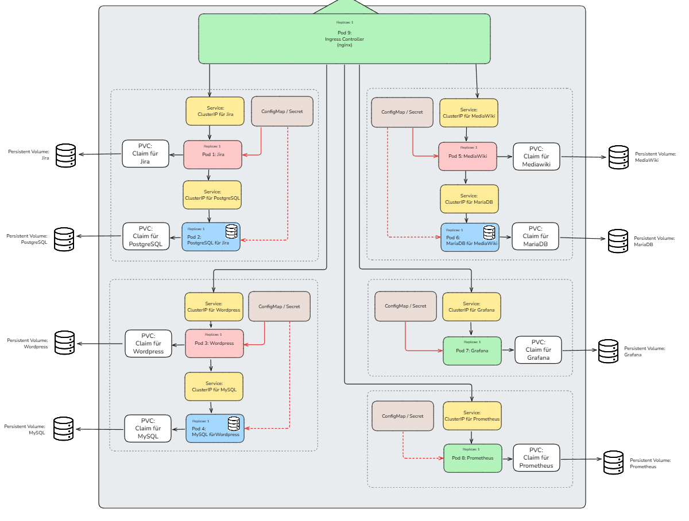

# Modul 347 - Dienst mit Container anwenden 

## Einleitung
Für das vorliegende Projekt wird eine containerisierte Umgebung auf Basis von Kubernetes aufgebaut, welche die drei Webanwendungen **WordPress**, **MediaWiki** und **Jira** zuverlässig bereitstellt. Ziel ist es, alle Applikationen inklusive Datenbanken mit Persistenz, Monitoring und Zugriff über einen zentralen **Ingress-Reverse-Proxy** in einem lokalen Cluster zu betreiben.

## Beispielszenario
Ein mittelständisches Unternehmen plant den Aufbau einer internen IT-Umgebung, die verschiedene Anforderungen zentral abdeckt:

- **WordPress** dient als öffentlich zugängliche **Unternehmenswebsite**, um Dienstleistungen, Neuigkeiten und Karriereseiten zu präsentieren.
- **MediaWiki** wird intern als **Wissensdatenbank** und **Intranet-Lösung** genutzt, um Dokumentationen, Teamwissen und Prozessbeschreibungen für Mitarbeitende bereitzustellen.
- **Jira** kommt als zentrales **Projektmanagement- und Ticketsystem** zum Einsatz, um Aufgaben, Bugs und Support-Anfragen strukturiert zu verwalten.

Die Firma legt grossen Wert auf **Skalierbarkeit**, **Zuverlässigkeit** und **Zugriffskontrolle**, weshalb die Umgebung containerisiert und mit Kubernetes orchestriert wird. Durch den Einsatz eines zentralen Ingress-Controllers können alle Dienste über eine gemeinsame Adresse und klar definierte Pfade bereitgestellt werden.

## Infrastrukturübersicht



Die Abbildung zeigt die geplante Infrastruktur für das Kubernetes-Projekt. Alle Komponenten laufen innerhalb eines lokalen Kubernetes-Nodes (Minikube). Der Zugriff erfolgt zentral über einen **Ingress-Controller** auf Basis von **nginx**, der als Reverse Proxy fungiert und die eingehenden Anfragen an die entsprechenden Dienste weiterleitet.

### Warum Kubernetes?

Kubernetes bietet gegenüber klassischen Containerlösungen wie Docker Compose deutliche Vorteile in Bezug auf Skalierbarkeit, Wiederherstellbarkeit und Verwaltung. Da das Unternehmen auf zukünftiges Wachstum und Ausfallsicherheit setzt, ist Kubernetes die ideale Grundlage für dieses Setup.

### Anwendungen und Datenbanken

Es werden insgesamt **drei Hauptanwendungen** betrieben:

- **Jira** (Projektmanagement)  
- **WordPress** (Unternehmenswebsite)  
- **MediaWiki** (Wissensdatenbank / Intranet)

Jede dieser Anwendungen läuft in einem eigenen **Pod** und kommuniziert über einen internen **ClusterIP-Service** mit einer zugehörigen **Datenbank**, die ebenfalls in einem eigenen Pod betrieben wird:

- Jira ↔ PostgreSQL  
- WordPress ↔ MySQL  
- MediaWiki ↔ MariaDB

### Monitoring

Für das Monitoring wird **Prometheus** eingesetzt, dessen Daten über **Grafana** visualisiert werden. Beide laufen in separaten Pods und nutzen eigene Services. Prometheus erhält zudem eine eigene Persistenz, um Metriken dauerhaft zu speichern.

### Persistente Speicherung

Alle Datenbank-Pods sowie Prometheus sind mit **Persistent Volume Claims (PVCs)** verbunden, die wiederum auf individuelle **Persistent Volumes (PVs)** zugreifen. Dadurch bleibt der Datenbestand auch bei Neustarts des Clusters erhalten. Insgesamt werden **vier Volumes** verwendet:

- PostgreSQL
- MySQL
- MariaDB
- Prometheus

### Konfiguration

Passwörter, Zugangsdaten und Konfigurationswerte werden über **ConfigMaps und Secrets** an die jeweiligen Pods übergeben. Dies ermöglicht eine sichere und flexible Verwaltung der Umgebungsparameter innerhalb des Clusters.

## Begriffserklärungen & Merksätze

### 🧱 Pod
Ein **Pod** ist die kleinste ausführbare Einheit in Kubernetes und enthält in der Regel einen oder mehrere Container, die gemeinsam laufen und Ressourcen wie Netzwerk und Speicher teilen. Jede Anwendung (z. B. WordPress) läuft in einem eigenen Pod.

**Merksatz:** *„Ein Pod ist wie ein Container-Gehäuse für deine App – darin lebt dein Programm.“*

### 🖥️ Node
Ein **Node** ist ein physischer oder virtueller Rechner im Kubernetes-Cluster, auf dem die Pods ausgeführt werden. In unserem Projekt handelt es sich um einen lokalen Node, der durch **Minikube** bereitgestellt wird.

**Merksatz:** *„Nodes sind das Fundament – Pods wohnen drauf.“*

### 🌐 Service
Ein **Service** ist eine Netzwerkschnittstelle in Kubernetes, die eine konstante Verbindung zu einem oder mehreren Pods ermöglicht – auch wenn sich deren IP-Adressen ändern. In diesem Projekt kommen **ClusterIP-Services** zum Einsatz, die innerhalb des Clusters erreichbar sind.

**Merksatz:** *„Pods kommen und gehen, Services bleiben bestehen.“*

### 🚪 Ingress
Ein **Ingress** ist eine Ressource in Kubernetes, die regelt, wie externe HTTP-Anfragen an interne Services weitergeleitet werden. Er definiert z. B., dass Anfragen an `/wp` an den WordPress-Service gehen.

**Merksatz:** *„Ingress ist der Türsteher deines Clusters – er sagt, wer rein darf und wohin.“*

### 🕸️ nginx (als Ingress-Controller)
**nginx** ist ein leistungsfähiger Webserver, der in Kubernetes als **Ingress-Controller** eingesetzt wird. Er liest die Ingress-Regeln aus und setzt sie technisch um, indem er als Reverse Proxy fungiert und Anfragen korrekt an die dahinterliegenden Services weiterleitet.

**Merksatz:** *„nginx ist der Postbote mit dem Stadtplan – er weiss, wohin jede Anfrage gehen soll.“*

### 💾 PVC (Persistent Volume Claim)
Ein **PVC** ist eine Speicheranfrage eines Pods. Ein Pod (z. B. eine Datenbank) beantragt damit Speicherplatz, der dauerhaft bestehen bleibt – auch beim Neustart oder bei Änderungen im Cluster.

**Merksatz:** *„PVC fragt: 'Kann ich bitte Speicher haben?' – PV sagt: 'Hier, nimm mich!'“*

### 💿 PV (Persistent Volume)
Ein **PV** ist der tatsächlich bereitgestellte Speicherplatz im Cluster, der von einem PVC beansprucht werden kann. Er stellt z. B. lokalen Speicher auf dem Minikube-Host bereit und wird vom System oder manuell verwaltet.

**Merksatz:** *„PV = Lagerplatz, PVC = Bestellung.“*

### 🔒 Secret
Ein **Secret** funktioniert wie eine ConfigMap, ist aber für sensible Daten gedacht – z. B. Passwörter, API-Schlüssel oder Zertifikate. Die Inhalte werden verschlüsselt gespeichert und sicher in Pods eingebunden.

**Merksatz:** *„Was in einem Secret steckt, bleibt geheim – wie das WLAN-Passwort zu Hause.“*

### ⚙️ ConfigMap
Eine **ConfigMap** speichert Konfigurationsdaten (z. B. Umgebungsvariablen) in Textform und stellt sie Pods zur Verfügung. Damit kann die Konfiguration einer Anwendung geändert werden, ohne den Container selbst neu zu bauen.

**Merksatz:** *„Die ConfigMap sagt deinem Pod, wie er sich verhalten soll – ohne dass du ihn neu baust.“*

### 📈 Prometheus
**Prometheus** ist ein Open-Source-Monitoring-System, das Messwerte wie CPU-Auslastung, Arbeitsspeicher und Netzwerkdaten sammelt und speichert. Es arbeitet auf Basis eines Pull-Prinzips und fragt regelmässig definierte Endpunkte ab.

**Merksatz:** *„Prometheus ist der Spion – er beobachtet alles, was dein System macht.“*

### 📊 Grafana
**Grafana** ist eine Plattform zur Visualisierung von Metriken aus verschiedenen Quellen (z. B. Prometheus). Damit lassen sich Dashboards erstellen, um Systemdaten anschaulich darzustellen und zu überwachen.

**Merksatz:** *„Grafana macht schön sichtbar, was Prometheus weiss.“*


## Benötigte Technologien und Software

- **Kubernetes** ist eine Open-Source-Plattform zur automatisierten Verwaltung, Skalierung und Bereitstellung von containerisierten Anwendungen.
- **Minikube** ist ein Tool, mit dem man einen lokalen Kubernetes-Cluster auf dem eigenen Rechner starten und testen kann.
- **Docker** ist eine Plattform, mit der Anwendungen in isolierten Containern verpackt, verteilt und ausgeführt werden können.
- **kubectl** ist das Kommandozeilenwerkzeug, mit dem man Kubernetes-Cluster verwaltet und Befehle an den Cluster senden kann.
- **Helm** ist ein Paketmanager für Kubernetes, mit dem Anwendungen samt ihrer Konfiguration einfach installiert und verwaltet werden können.

## Aufsetzen der Basis-Infrastruktur

### Docker installieren
Zunächst wird **Docker Desktop** installiert, inklusive des benötigten **Windows Subsystem for Linux (WSL)**. Dazu die Datei `Docker Desktop Installer.exe` (https://www.docker.com/get-started/) ausführen und den Anweisungen folgen. Nach Abschluss der Installation ist ein **Neustart des Systems erforderlich**.

Beim ersten Start kann eine Aufforderung zur Aktualisierung von WSL erscheinen – diese sollte unbedingt bestätigt werden. Anschliessend Docker starten und sicherstellen, dass der Dienst läuft. Der optional angebotene Docker-Account bzw. Sign-Up-Prozess kann übersprungen werden.

### Minikube installieren
Als nächstes muss die Anwendung **Minikube** installiert werden. Minikube ermöglicht es, einen lokalen Kubernetes-Cluster auszuführen. Der benötigte Installer trägt den Namen `minikube-installer.exe`.

Die aktuelle Version kann auf der offiziellen Website heruntergeladen werden:  
[https://minikube.sigs.k8s.io/docs/start/](https://minikube.sigs.k8s.io/docs/start/)

Nach dem Download einfach die Installationsdatei ausführen und den Anweisungen folgen.

### Installation von kubectl

**kubectl** muss nicht installiert, sondern lediglich heruntergeladen und eingebunden werden. Die ausführbare Datei `kubectl.exe` kann unter folgendem Link bezogen werden:  
[https://kubernetes.io/docs/tasks/tools/install-kubectl-windows/](https://kubernetes.io/docs/tasks/tools/install-kubectl-windows/)

Erstelle einen Ordner namens `C:\kubetools` und speichere die heruntergeladene Datei darin.

### Hinzufügen zur Umgebungsvariablen (Path)

Damit `kubectl` bequem im Terminal aufgerufen werden kann, muss der Pfad zum Ordner `C:\kubetools` in die **Windows-Umgebungsvariablen** aufgenommen werden:

1. Öffne das Startmenü und suche nach **„Umgebungsvariablen für dieses Konto bearbeiten“**.
2. Im oberen Bereich („Benutzervariablen“) den Eintrag **„Path“** auswählen und auf **„Bearbeiten“** klicken.
3. Im neuen Fenster auf **„Neu“** klicken, dann auf **„Durchsuchen“** und den Ordner `C:\kubetools` auswählen.
4. Änderungen mit **OK** bestätigen und den Computer **neu starten**.

Nach dem Neustart ein Terminal (CMD oder PowerShell) öffnen und folgenden Befehl testen:

```powershell
kubectl version --client
```

### Installation von Helm

Auch **Helm** muss nicht klassisch installiert werden, sondern wird lediglich heruntergeladen und eingebunden. Die passende Version für Windows (amd64) kann hier heruntergeladen werden:  [https://github.com/helm/helm/releases](https://github.com/helm/helm/releases)

Nach dem Download das ZIP-Archiv entpacken und die Datei `helm.exe` in den Ordner `C:\kubetools` verschieben – wie bereits bei `kubectl`.

Anschliessend ein Terminal (CMD oder PowerShell) öffnen und mit folgendem Befehl prüfen, ob Helm korrekt funktioniert:

```powershell
helm version
```

### Kubernetes-Cluster starten

Zum Abschluss muss der lokale **Kubernetes-Cluster** über Minikube gestartet werden. Dies geschieht mit folgendem Befehl:

```powershell
minikube start --driver=docker
```
Beim ersten Start kann der Vorgang etwa 5–10 Minuten dauern, da notwendige Komponenten und Images heruntergeladen werden.

Sollte eine Fehlermeldung erscheinen, liegt das in den meisten Fällen daran, dass Docker nicht läuft – in diesem Fall Docker Desktop zuerst starten und es erneut versuchen.

Nach erfolgreichem Start zur Überprüfung folgenden Befehl ausführen:
```powershell
kubectl get nodes
```
Wenn ein Node mit dem Status Ready angezeigt wird, ist die Basisinstallation abgeschlossen und der Kubernetes-Cluster läuft einsatzbereit.
